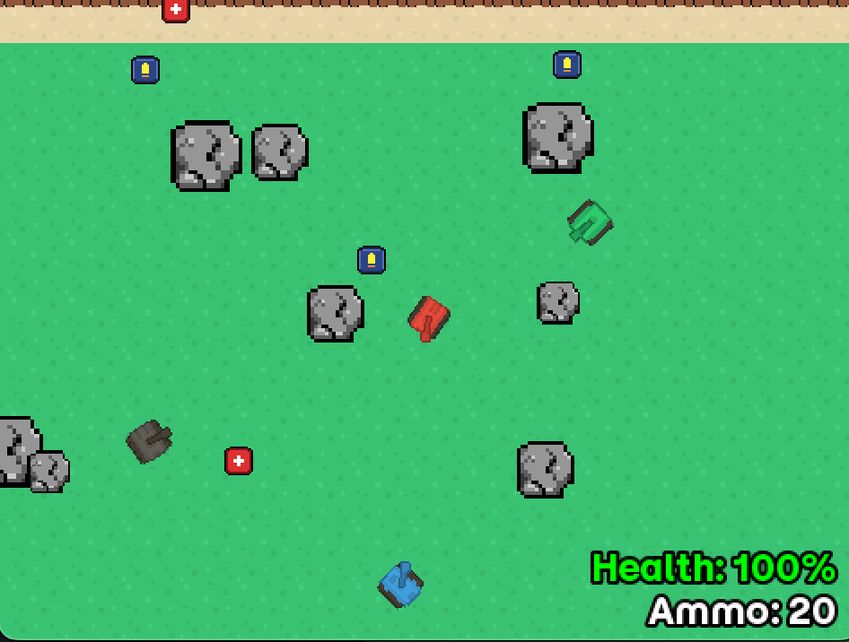

# .io-Style Tank Game  
**José Pablo González Poblette** — **Student ID: 2507739**

## Description

Final project for the module **CMP501 – Network Game Development** at **Abertay University, Scotland**.

This project is a multiplayer server–client game developed in **C++** using the **SFML** framework. The game follows an *.io-style* design and includes the following core mechanics:

- Movement using **WASD**
- Aiming with the **left and right arrow keys**
- Shooting with the **space bar**

The game world is procedurally generated using a random seed sent by the server to all connected clients. This guarantees a consistent world layout for every player, featuring environmental obstacles such as rocks, as well as interactive elements like health kits and ammo boxes to give a complete game enviroment for players to move and have fun!

## Project Instructions

### IDE and Build Setup
The project was developed using the **CLion IDE**, which works with a `CMakeLists.txt` file.  
If you want to download and run the program in another IDE, such as **Visual Studio**, it will require converting the project into their format. In Visual Studio, this format is a **.sln (solution)** file.

For details on how this can be done, see:  
[CMake projects in Visual Studio (Microsoft Learn)](https://learn.microsoft.com/en-us/cpp/build/cmake-projects-in-visual-studio?view=msvc-170)

---

### Server Configuration
The game will automatically run on **localhost**, but if for any reason you want to load the server with a different port or IP, or if you encounter any bugs, you can easily change the settings in the `config.txt` file located in the root folder.

---

### Execution Order
Once you have launched the application, **please follow this order of execution**:

1. The application will ask if you want to launch as **server** or **client**.  
   - Select **[1] for server**. This will start the server, keep it waiting for players to join, and create the game window.

2. After successfully launching the server, open another window of the application.  
   - Select **[2] to join as a client (player)**.

3. You’re all set! You should now be able to move and shoot around the world.  
   - If you want to add more players, simply repeat the same procedure.  
   - **Up to 4 players can join and play in the same world.**

---

